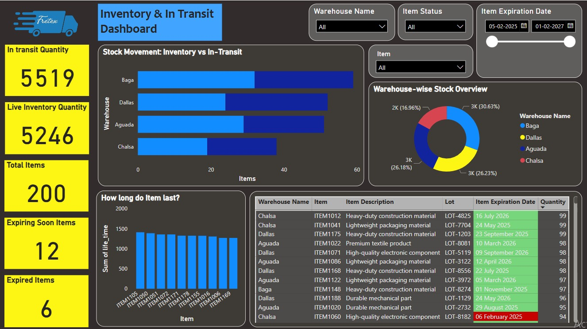

# Inventory & In-Transit Dashboard 📊

# Overview
This Power BI dashboard provides insights into inventory levels and in-transit stock, categorized by warehouse, item status, and expiration dates. It features:
✅ KPI cards for quick insights  
✅ Interactive stacked bar and column charts  
✅ Donut chart for inventory distribution  
✅ Conditional formatting for expiration status  
✅ Date range slicers for better filtering  

## Technologies Used
- **Power BI**
- **DAX for calculated columns**
- **Data transformation using Power Query**

## Dashboard Preview

## Features & Insights
- **Warehouse Inventory Overview:** Breakdown of items in stock vs. in transit  
- **Item Expiry Monitoring:** Highlighting expired and soon-to-expire items  
- **Interactive Filtering:** Clickable elements to refine insights dynamically  
- **Performance Metrics:** Inventory turnover, total items, and category distribution  

## How to Use
1. Open `Inventory.pbix` in Power BI.
2. Interact with filters to explore the data.
3. Customize further based on your business needs.

## Future Improvements
- Add real-time data connection
- Implement advanced forecasting
